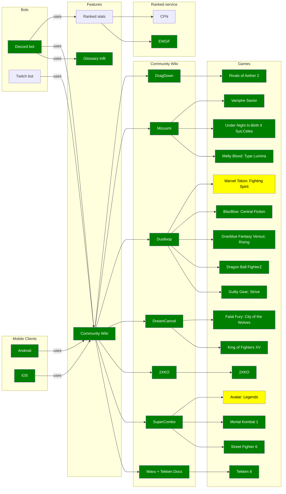

# FightingNerd

Frame data targeting Discord bot and mobile apps:
- 🧩 highly extensible
  - 📘 glossary
  - 📚 [any community Wikis](https://github.com/Sophon/FightingNerd/wiki/Features#list-of-feature-modules)
- 🌐 multiplatform:
  - [](https://play.google.com/store/apps/details?id=io.github.sophon.fightingnerd)
  - [](https://apps.apple.com/us/app/fighting-nerd/id6793185357)
  -  [](https://discord.com/discovery/applications/1438716136790429776)


[](https://ko-fi.com/sorryuken)

[](https://buymeacoffee.com/sophon)


## Sample Usage

All commands are case **insensitive** - uppercase or lowercase or anything in between is identical.

All commands can be used in one of two ways:
1. tag - `@bot [command] [query]`
2. slash - `/command [query]`

In the signatures below, `<param>` is required and `[param]` is optional.

- **frame data** - `fd <character> <move>`
  - `<move>` can be input or move name
  - default command: `@bot <character> <move>` and `@bot fd <character> <move>` are identical
  - game specific variants: `fdTK`, `fdSF`, `fdGG` etc.
  - examples: `@bot ak f21` or `@bot ken 236pp` or `@bot sol fafnir`
- **character data** - `char <game> <character>`
  - game specific variants: `charGG`, `charSF`, `charAV` etc.
  - examples: `@bot charsf akuma` or `@bot charroa olympia`
- **game specific commands**
  - Tekken 8
    - `Heat <character>`, `Homing <character>`, `PC <character>`
    - `Stance <character> [stance]`
      - examples: `@bot stance steve` or `@bot stance king jgs`
    - `Strings <character> <input>`
      - examples: `@bot strings eddy u4`
  - `Inv <character>` - invincible moves
- **ELO**
  - Tekken 8
    - `EWGF [operation] [tekkenID]` - https://ewgf.gg/
      - operations:
        - `register` (or `+`), requires `<tekkenID>`: registers your Discord account
          - example: `@bot ewgf + 3DgB8jQ82rJ4`
        - (no operation): displays your last 50 matches
          - example: `@bot ewgf`
        - `unregister` (or `-`): deletes your Discord account from the database
          - example: `@bot ewgf -`
- **utility commands**
  - `Alias` - displays character aliases for a game
  - `Commands` - lists all available commands
  - `Donate` - displays links to support the project
  - `Examples` - displays example bot usage
  - `Feedback <message>` - sends feedback or bug report to the author
  - `Invite` - displays the invitation link
  - `Join <steamURL> [password|name]` - creates a clickable link to join a Steam lobby
    - default bot command: `@bot steam://joinlobby/...` or `@bot join steam://joinlobby/...` are identical
  - `Modules` - displays all enabled modules, be it games or otherwise
  - `Repo` - displays the GitHub link to the project

### [CURRENT FEATURE MODULES](https://github.com/Sophon/FightingNerd/wiki/Features#list-of-feature-modules)



## [CHECK THE WIKI](https://github.com/Sophon/FightingNerd/wiki)

### [Long term goals](https://github.com/Sophon/FightingNerd/wiki/Features#planned-feature-modules):
- Twitch bot
- ELO rank services

___
# [License](https://github.com/Sophon/FightingNerd/blob/feat/sorry/license/LICENSE.txt)
```
License: Apache 2.0 with Commons Clause

Licensed under the Apache License, Version 2.0 (the "License");
you may not use this file except in compliance with the License.
You may obtain a copy of the License at

    http://www.apache.org/licenses/LICENSE-2.0

Unless required by applicable law or agreed to in writing, software
distributed under the License is distributed on an "AS IS" BASIS,
WITHOUT WARRANTIES OR CONDITIONS OF ANY KIND, either express or implied.
See the License for the specific language governing permissions and
limitations under the License.

Additional restriction: Commons Clause - you may not sell the software 
or offer it as a service. See LICENSE.txt for full terms.

© 2025 Sophon
```


