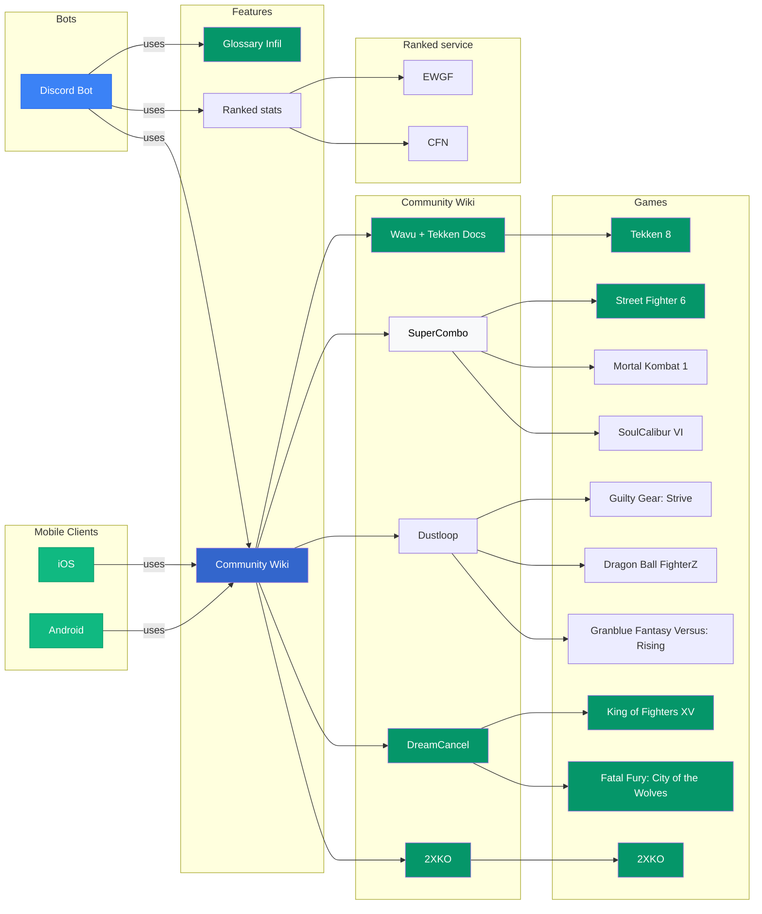

# FightingNerd

Frame data targeting Discord bot and mobile apps:
- 🧩 highly extensible
  - 📘 glossary
  - 📚 [any community Wikis](https://github.com/Sophon/FightingNerd/wiki/Features#list-of-feature-modules)
- 🌐 multiplatform:
  - 🤖 Android
  - 🍏 iOS
  - 💬 Discord

[](https://discord.com/oauth2/authorize?client_id=1438716136790429776&permissions=346112&integration_type=0&scope=applications.commands+bot)

[](https://ko-fi.com/V7V01OEMXE)


### [CURRENT FEATURE MODULES](https://github.com/Sophon/FightingNerd/wiki/Features#list-of-feature-modules)



# [CHECK THE WIKI](https://github.com/Sophon/FightingNerd/wiki)

### [Long term goals](https://github.com/Sophon/FightingNerd/wiki/Features#planned-feature-modules):
- Twitch bot
- ELO rank services

___
# [License](https://github.com/Sophon/FightingNerd/blob/feat/sorry/license/LICENSE.txt)
```
License: Apache 2.0 with Commons Clause

Licensed under the Apache License, Version 2.0 (the "License");
you may not use this file except in compliance with the License.
You may obtain a copy of the License at

    http://www.apache.org/licenses/LICENSE-2.0

Unless required by applicable law or agreed to in writing, software
distributed under the License is distributed on an "AS IS" BASIS,
WITHOUT WARRANTIES OR CONDITIONS OF ANY KIND, either express or implied.
See the License for the specific language governing permissions and
limitations under the License.

Additional restriction: Commons Clause - you may not sell the software 
or offer it as a service. See LICENSE.txt for full terms.

© 2025 Sophon
```


