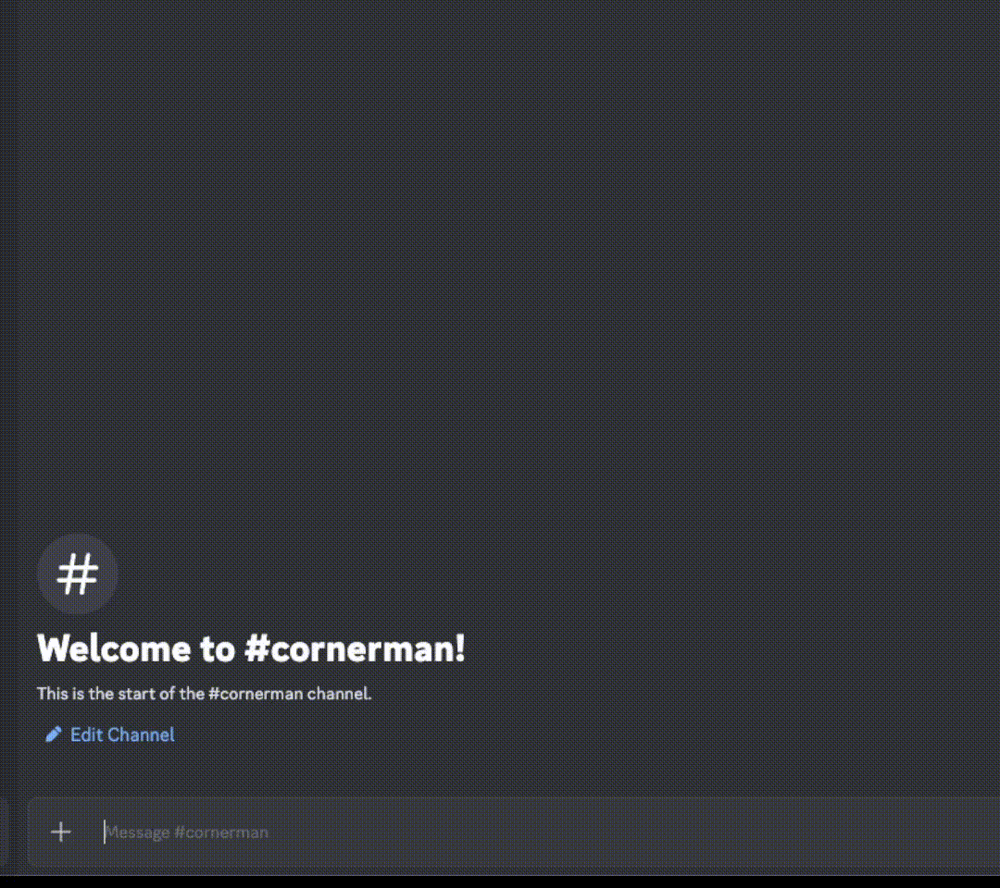
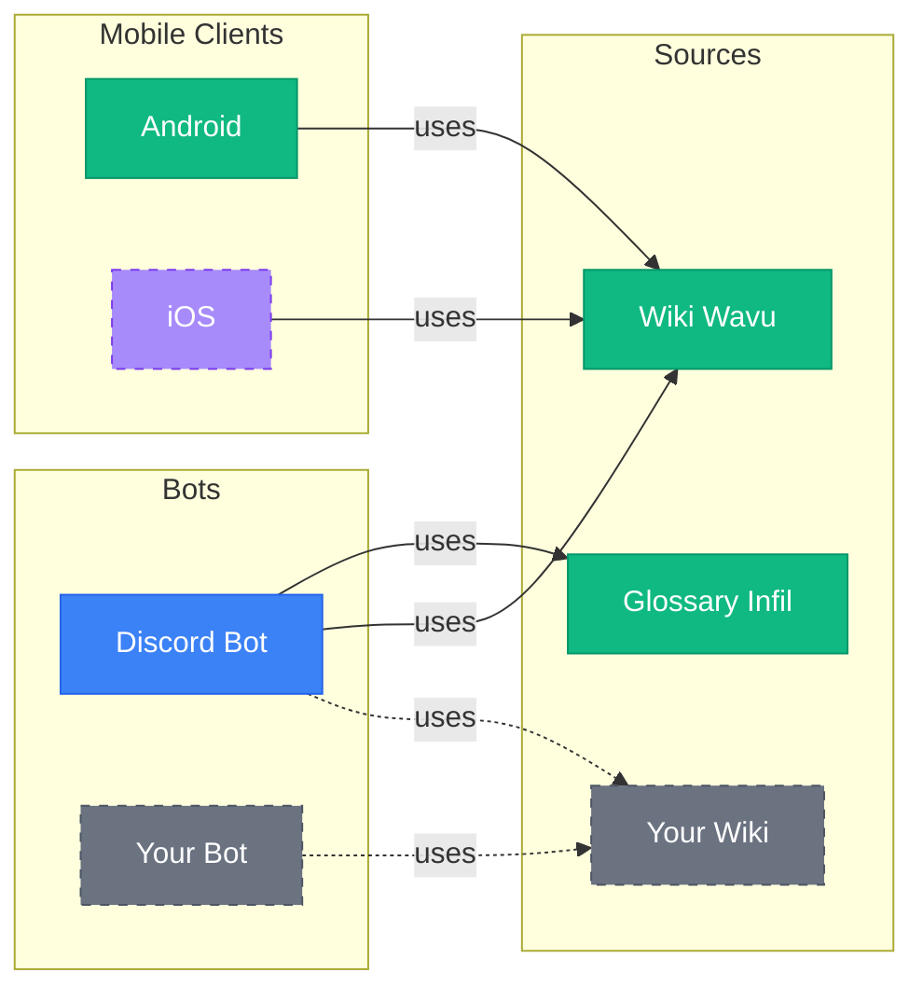

# A set of tools for fighting games

A shared code-base with various tools:
- [modular](https://github.com/Sophon/Cornerman/wiki/Extending-the-bot) - easily extend support for SuperCombo Wiki, Dustloop etc
- Tekken 8
  - [fighting-game glossary](./feat/glossaryInfil/src/main/kotlin/InfilGlossary.kt) from [Infil](https://glossary.infil.net/)
  - [frame data](./feat/wikiWavu/src/main/kotlin/WavuWikiClient.kt) and other functionalities from [Wavu Wiki](https://wavu.wiki/)
  - [Discord bot](./feat/botDiscord/src/main/kotlin/DiscordBot.kt)

# Features

<details>
<summary>Frame data</summary>



</details>

<details>
<summary>Fighting game glossary</summary>


</details>

### Modularity



### TODO's:
- Discord bot
  - frame data
    - `/ms` command 
      - moves that are the same start-up or faster
  - `/feedback` command
    - also banlist
  - reaction commands for Discord embeds
  - bot version
- mobile client
- documentation
  - Mermaid diagram and description for code-base structure
  - guide on running the Discord bot 

### Long term goals:
- Twitch bot
- Docker, pipelines, updates
- frame data for older games
- Wank Wavu functionality

___
# Code-base structure
TODO: Mermaid diagram

___

* [/composeApp](./composeApp/src) is for code that will be shared across your Compose Multiplatform applications.
  It contains several subfolders:
  - [commonMain](./composeApp/src/commonMain/kotlin) is for code that’s common for all targets.
  - Other folders are for Kotlin code that will be compiled for only the platform indicated in the folder name.
    For example, if you want to use Apple’s CoreCrypto for the iOS part of your Kotlin app,
    the [iosMain](./composeApp/src/iosMain/kotlin) folder would be the right place for such calls.
    Similarly, if you want to edit the Desktop (JVM) specific part, the [jvmMain](./composeApp/src/jvmMain/kotlin)
    folder is the appropriate location.

* [/iosApp](./iosApp/iosApp) contains iOS applications. Even if you’re sharing your UI with Compose Multiplatform,
  you need this entry point for your iOS app. This is also where you should add SwiftUI code for your project.

### Build and Run Android Application

To build and run the development version of the Android app, use the run configuration from the run widget
in your IDE’s toolbar or build it directly from the terminal:
- on macOS/Linux
  ```shell
  ./gradlew :composeApp:assembleDebug
  ```
- on Windows
  ```shell
  .\gradlew.bat :composeApp:assembleDebug
  ```

### Build and Run Desktop (JVM) Application

To build and run the development version of the desktop app, use the run configuration from the run widget
in your IDE’s toolbar or run it directly from the terminal:
- on macOS/Linux
  ```shell
  ./gradlew :composeApp:run
  ```
- on Windows
  ```shell
  .\gradlew.bat :composeApp:run
  ```

### Build and Run iOS Application

To build and run the development version of the iOS app, use the run configuration from the run widget
in your IDE’s toolbar or open the [/iosApp](./iosApp) directory in Xcode and run it from there.

---
