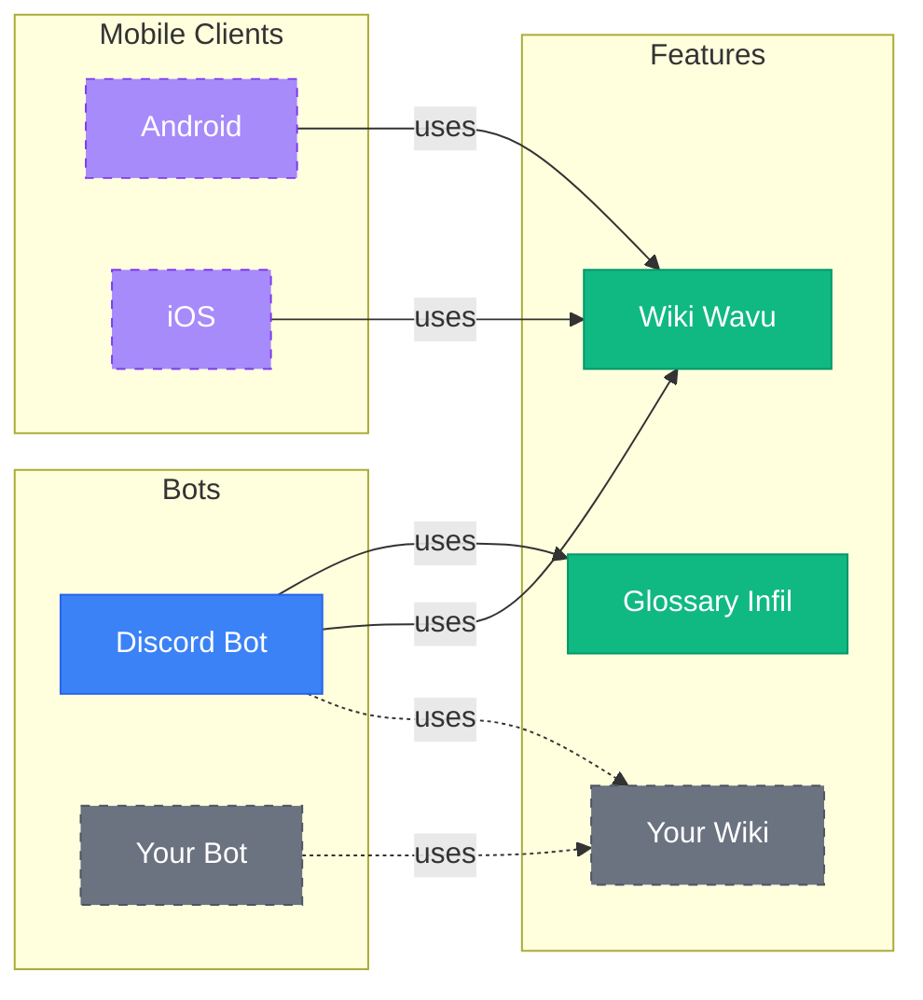

# A set of tools for fighting games

A fully [modular](https://github.com/Sophon/Cornerman/wiki/Adding-new-features) set of tools for the fighting game community.

### FEATURES
- [🌟 frame data commands](https://github.com/Sophon/Cornerman/wiki/Tekken-8-features)
- [🌟 fighting game glossary](https://github.com/Sophon/Cornerman/wiki/Fighting-game-glossary)

### CURRENT FEATURE MODULES
- [Discord bot](./feat/botDiscord/src/main/kotlin/DiscordBot.kt)
- [fighting-game glossary](./feat/glossaryInfil/src/main/kotlin/InfilGlossary.kt) from [Infil](https://glossary.infil.net/)
- [Tekken 8 frame data](./feat/wikiWavu/src/main/kotlin/WavuWikiClient.kt) from [Wavu Wiki](https://wavu.wiki/)
- Tekken 8 `pc` and `heat` commands

# [CHECK THE WIKI](https://github.com/Sophon/Cornerman/wiki/Adding-new-features)

### TODO's:
- Discord bot
  - frame data
    - `/ms` command 
      - moves that are the same start-up or faster
  - `/feedback` command
    - also banlist
  - reaction commands for Discord embeds
  - bot version
  - other wikis
    - SuperCombo wiki
    - Dustloop wiki
  - module configuration
- Docker, pipelines, updates
- mobile client

### Long term goals:
- Wank Wavu functionality
- Twitch bot
- frame data for older games

