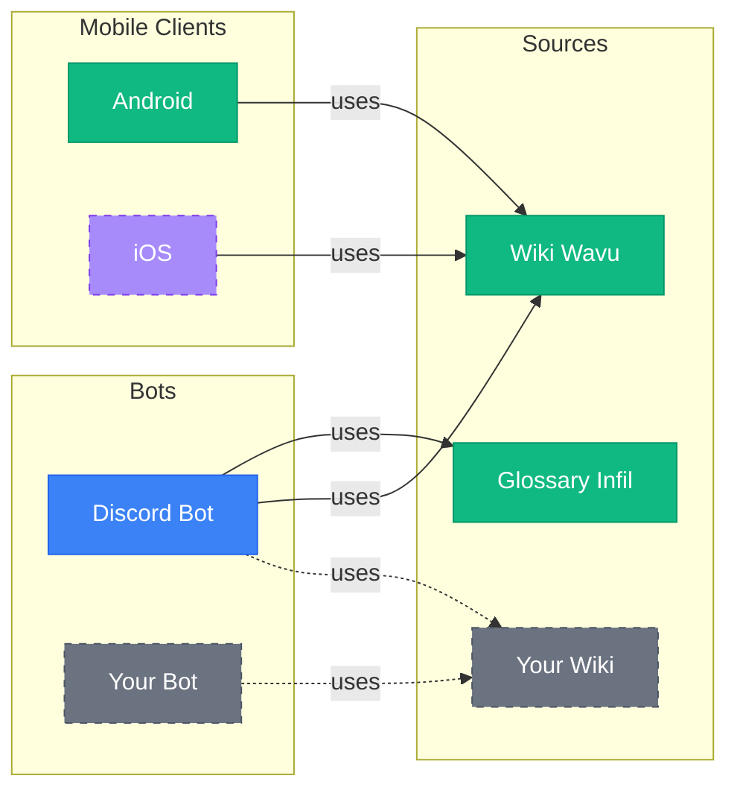

# A set of tools for fighting games

A shared code-base with various tools:
- [modular](https://github.com/Sophon/Cornerman/wiki/Extending-the-Discord-bot) - easily extend support for SuperCombo Wiki, Dustloop etc
- Tekken 8
  - [fighting-game glossary](./feat/glossaryInfil/src/main/kotlin/InfilGlossary.kt) from [Infil](https://glossary.infil.net/)
  - [frame data](./feat/wikiWavu/src/main/kotlin/WavuWikiClient.kt) and other functionalities from [Wavu Wiki](https://wavu.wiki/)
  - [Discord bot](./feat/botDiscord/src/main/kotlin/DiscordBot.kt)

# Features

### Modularity

Frame data

Fighting game glossary

### TODO's:
- Discord bot
  - frame data
    - `/ms` command 
      - moves that are the same start-up or faster
  - `/feedback` command
    - also banlist
  - reaction commands for Discord embeds
  - bot version
  - SuperCombo wiki
  - Dustloop wiki
  - config for modules
- mobile client

# Features
### Frame data

### Fighting game glossary

### Long term goals:
- Twitch bot
- Docker, pipelines, updates
- frame data for older games
- Wank Wavu functionality

